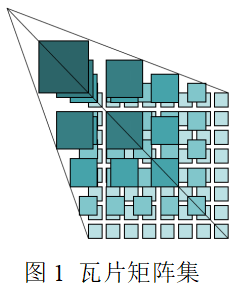
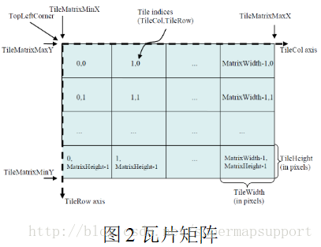
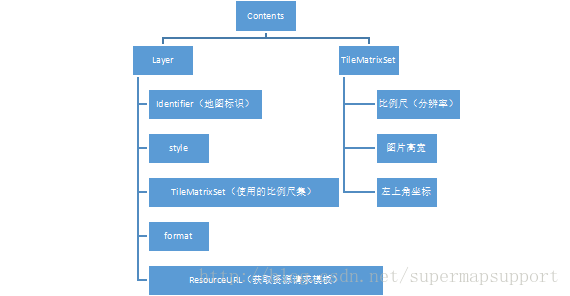

; Author: Bu Kun
; Title: Preliminary understanding and reading of WMTS service

# Preliminary understanding and Reading of WMTS Service

Currently, most of the network map services use caching technology to replace real-time visualization of data to improve map response capabilities. Introduces the WMTS service of the caching technology standard proposed by OGC.

## Introduction to WMTS

WMTS, OpenGIS Web Map Tile Service, provides a standardized solution for publishing digital map services using predefined tile methods.
The WMTS standard defines operations that allow users to access tiled maps. The WMTS service is an open standard service docking format proposed by OGC, and it is also an improved version of the WMS service. Therefore, more and more GIS projects use the WMTS service as the basemap service. The map as a basemap service is the WMTS service that connects to the sky map.

## Difference between WMTS and WMS

The WMTS service and the WMS service have different responses to the client's request for service. For example, when the client requests the WMTS service, a fixed-size tile is returned to the client. The client obtains each tile according to the index number, and then splices it. It is displayed as a map, as shown in Figure 1; since the rules of tiles are fixed, the server can cache the corresponding tiles in advance, and the client can return it directly when needed, so WMTS can be cached.

When the client requests the WMS service, a complete picture is returned to the client, and the client can get it and display it directly, as shown in Figure 2; the client can request any area, because of this arbitrariness and the server can only Returning a picture of a specified range, the probability of reuse is low and low. When the concurrency increases, the performance of the server will be greatly reduced, so WMS only focuses on flexibility. The Internet era focuses on efficiency. Compared with flexibility, people prefer to use cacheable WMTS services with better performance.

## Principle of WMTS slicing

WMTS stipulates that the tile matrix set (Tile Matrix Set) is used to represent the cut map, as shown in figure 1, different tile matrices have different scales (resolution).
Each tile matrix is identified by the tile matrix identifier (usually the serial number of the tile matrix, and the lowest resolution layer is the 0 layer, which is arranged up in turn).

Each tile in the tile matrix is identified by the row and column number of the tile. The row and column numbers are counted from the tile where the upper left corner of the tile matrix is located, and the starting row and column values are (0, 0), in order downward. Increase to the right, as shown in Figure 2, that is, take the index number of the tile.

WMTS service providers can publish WMTS services as long as they follow the WMTS specification of the OGC standard, but in order to improve service compatibility
WMTS also proposed the concept of well-known scale set (Well-known scale set).
It is a well-known combination of a coordinate reference system and several scale sets.
Common well-known scale sets are GlobalCRS84Scale, GlobalCRS84Pixel,
GoogleCRS84Quad and GoogleMapsCompatible.

SuperMap iServer provides the ability to publish WMTS services
And conforms to the WMTS implementation specification developed by OGC (Open Geospatial Consortium, Open Geographic Information Alliance).

## Reading of WMTS

The WMTS 1.0.0 specification supports publishing WMTS services in HTTP KVP (Key-Value Pair), SOAP, and REST.
Taking HTTTP KVP as an example, this paper introduces the three operations contained in WMTS service, which can be used to read WMTS service.

1. GetCapabilities operation to get the meta-information of the service
2. GetTile operation, getting slices
3. GetFeatureInfo operation to get the selected feature information.

In the three operations, you can first obtain a Capabilities document through the GetCapabilities operation. The capability document is in the form of xml structure. The document describes the resources available in the service and the necessary conditions for connecting the service. The following node information is from the capability document. The key parameters that need to be obtained in the connection to the WMTS service.

In the document, the contents node describes the information of the WMTs service published by the server. Understanding the structure of layer (metadata of a top-level dataset on the server) and tilematrixset (description of map segmentation geometric rules) in the contents subset can help users obtain the corresponding data accurately.