; Author: YU Jinyao
; Title: Introduction and installation of PostGIS

# Introduction and installation of PostGIS

## PostgresSQL:

PostgreSQL is an object-relational database management system (ORDBMS), and it is also the most powerful, feature-rich and complex free software database system at present. It originated from Berkeley's (BSD) database currently the most powerful, feature-rich and complex research program, and is currently one of the most important open source database product development projects with a very wide range of users.

"Relational database + spatial data engine" is usually a middleware solution developed by GIS manufacturers in recent years. Users hand over their own spatial data to a spatial data engine independent of the database. There is a spatial data engine to organize the storage of spatial data in a relational database; when users need to access data, they will notify the spatial data engine, and there is an engine. Take data from relational databases and convert it into a way that customers can use.

## PostGIS:

PostGIS is an extension of the object-relational database system PostgreSQL. PostGIS provides the following spatial information service functions: spatial objects, spatial indexes, spatial operation functions and spatial operators. Meanwhile, PostGIS follows the specifications of OpenGIS.
The copyright of PostGIS is incorporated into the GNU GPL, which means that anyone can freely obtain the source code of PostGIS and do research and improvement on it. Because of this, PostGIS has developed rapidly, and more and more enthusiasts and research institutions are involved in the application development and improvement of PostGIS.

PostGIS supports all spatial data types including: POINT, LINESTRING, POLYGON, MULTIPOINT, MULTILINESTRING, MULTIPOLYGON, and GEOMETRYCOLLECTION )and many more. PostGIS supports all object representation methods, such as WKT and WKB.

Several advantages:

- PostGIS supports all data access and construction methods, such as `GeomFromText()`, `AsBinary()`, and GeometryN(), etc.
- PostGIS provides simple spatial analysis functions (such as Area and Length) and other functions with complex analysis functions, such as Distance.
- PostGIS provides support for metadata, such as `GEOMETRY_COLUMNS` and `SPATIAL_REF_SYS`, and PostGIS also provides corresponding support functions, such as `AddGeometryColumn` and `DropGeometryColumn` .
- PostGIS provides a series of binary predicates (such as Contains, Within, Overlaps and Touches) for detecting the spatial relationship between spatial objects, and returns a Boolean value to characterize the relationship between objects.
- PostGIS provides spatial operators (such as Union and Difference) for spatial data manipulation. For example, the Union operator blends the boundaries between polygons. Two overlapping polygons will form a new polygon through Union operation, and the boundary of this new polygon is the largest boundary of the two polygons.

Several features are available:

- `Database Coordinate Transformation`: Geometry types in the database can be transformed from one projection system to another through the `Transform` function. Geometry types in `OpenGIS` all have `SRID` as part of their structure, but for some reason, in the `SFSQL` specification of `OpenGIS` , and does not introduce `Transform`.
- `Sphere length calculation`: Collection types stored in a common geographic coordinate system cannot perform degree calculations without coordinate transformation. The coordinate transformation provided by OpenGIS makes it possible to calculate the degree of accumulation type.
- `3D geometry type`: The SFSQL specification is only for 2D collection types. `OpenGIS` provides support for 3D collection types, specifically using the input collection type dimension to determine the output representation. For example, pure 2D intersections are usually returned in 2D even though all geometry objects are internally stored in 3D. In addition, the function of converting geometric objects between different dimensions is provided.
- `Spatial aggregate function`: In a database, an aggregate function is a function that performs all data operations on an attribute column. For example, Sum and Average, Sum is to find the sum of the data of a relational attribute column, `Average` is to find the average of the data of a relational attribute column. Correspondingly, the spatial aggregate function also performs the same operation, but the object of the operation is spatial data. For example, the aggregate function Extent returns the largest wrapping rectangle in a series of elements. For example, the execution result of the SQL statement "SELECT EXTENT(GEOM) FROM ROADS" returns all wrapping rectangles in the ROADS data table.
- `Raster data type`: PostGIS provides storage for large raster data objects through a new data type slice. A slice consists of the following parts: a wrapping rectangle, `SRID`, a type, and a sequence of bytes. Fast random access is made possible by keeping the slice size below the database page value (32x32).

Generally large pictures are also stored in the database by cutting them into 32×32 pixel slices.

## Installation

The installation command under Debian/Ubuntu Linux:

    sudo apt install postgresql
    sudo apt install postgis

or Download the binary file via [https://www.postgresql.org/download/](https://www.postgresql.org/download/) : 

For the management of the PostgreSQL database, we can use `pgadmin` GUI programe.
This tool could be downloaded via [https://www.pgadmin.org/download/](https://www.pgadmin.org/download/) .

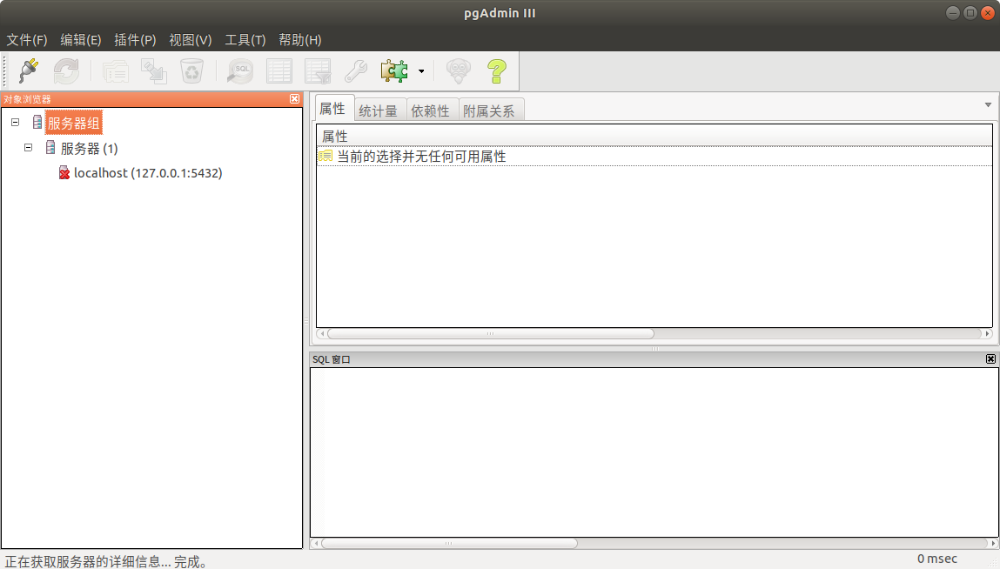

## Use

First, prepare a `shpfile` File.

There are two ways to import an shp file into a database:

But first, you need to create a database and add `PostGIS` ， `schema` ( optional)

    sudo -u postgres psql
    create database demo;
    \c demo
    create extension postgis;
    create schema shpdata;
    
### Method 1

`pgadmin` plugin `import` import directly：

- Open `pgadmin` click on the plugin `import`；

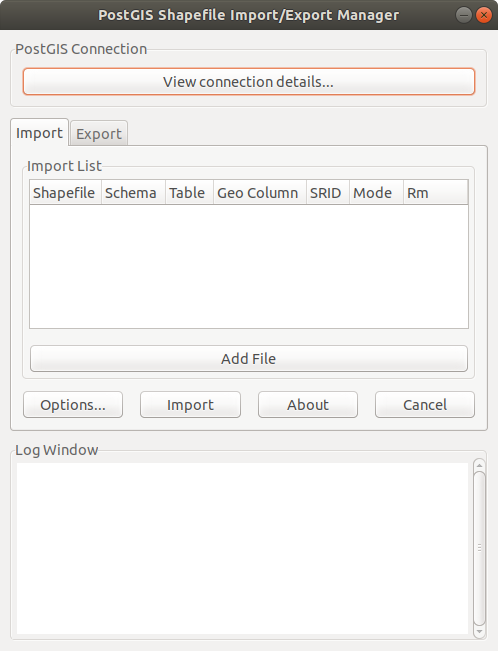

- To connect to the database, first create the data and import it into `PostGIS`: Click `connection` to enter the username, password, and database to be used

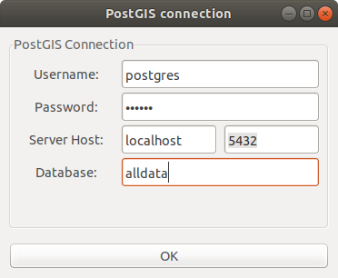

- After the prompt is successful, click `Add file` to select the file extension you want to import with the suffix `.shp`

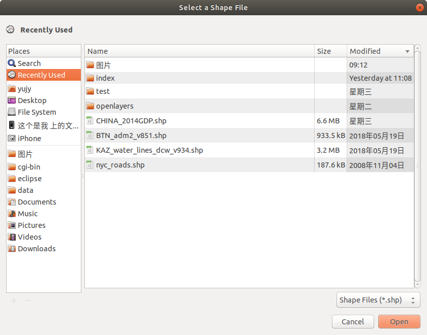

- After adding, modify the `schema` `table` and add it to the position you want

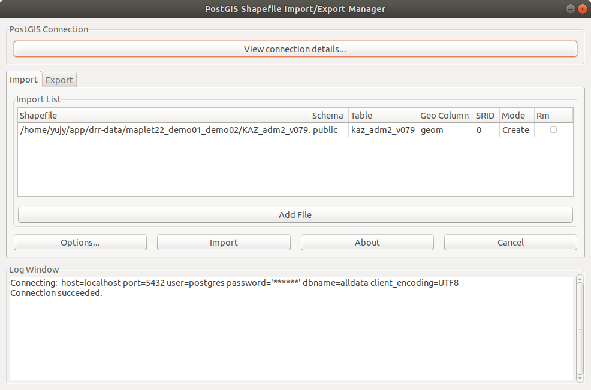

- After setting, click `import` as shown in the figure below, indicating that the import is complete.
  

### Method 2

Import with the command line tool:

    
     shp2pgsql -s 3857 -I dir/xx.shp  shpdata.demo | psql -h localhost -p 5432 -d demo -U postgres -W 
                        
- s `SRID`
- I the address where the I file is located
- h server address
- p port
- d database name
- U username
- W password
- shpdata `schema`
- | Pipe sql into database

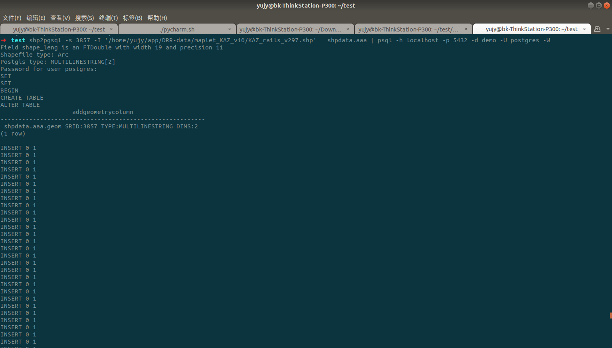

## Publish

Enter the `GeoServer` operation page:

- Select the left workspace

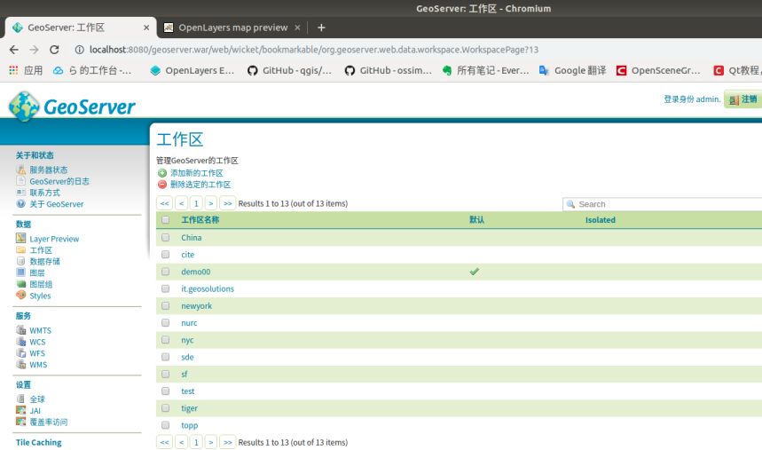

- Select new workspace

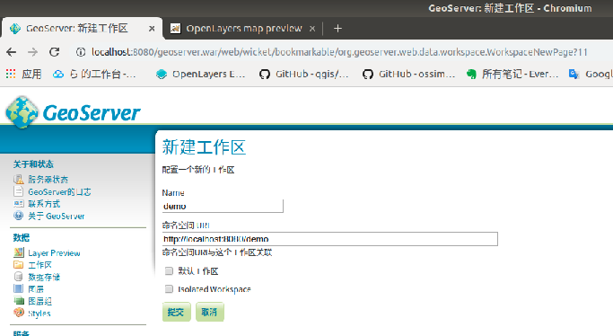

- Fill in `name`、`URI`

- Select data within `Datastore`

- Add new datastore

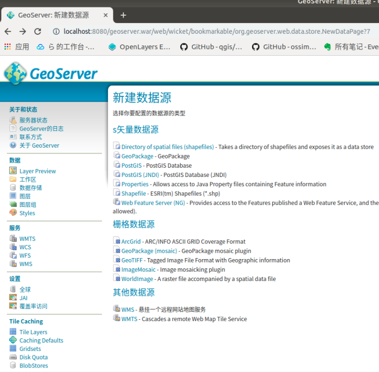

- Select the workspace, fill in the connection parameter database, username and password

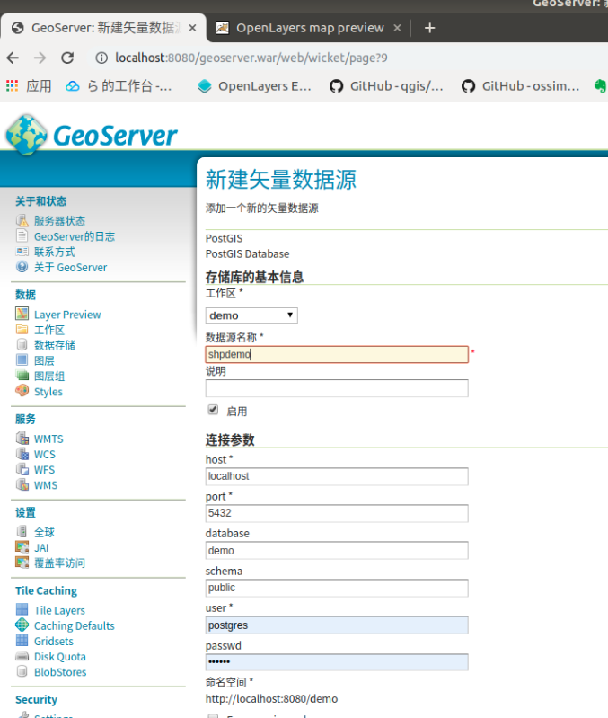

- After saving, it will automatically jump and click the publish button

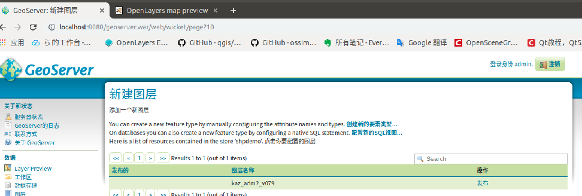

- Set coordinate 
- 
- reference and border

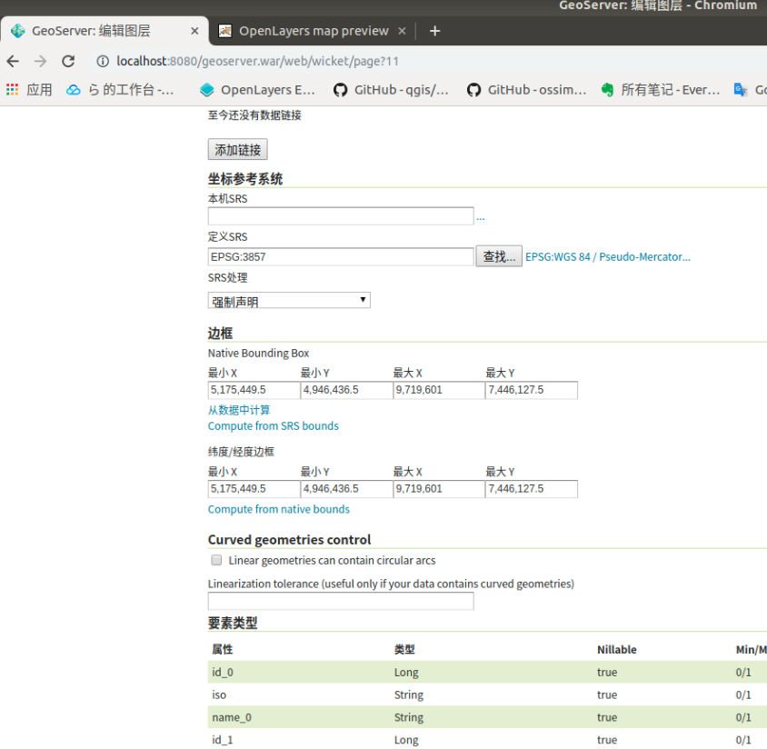

- After saving, find `layer Preview` in the left menu bar

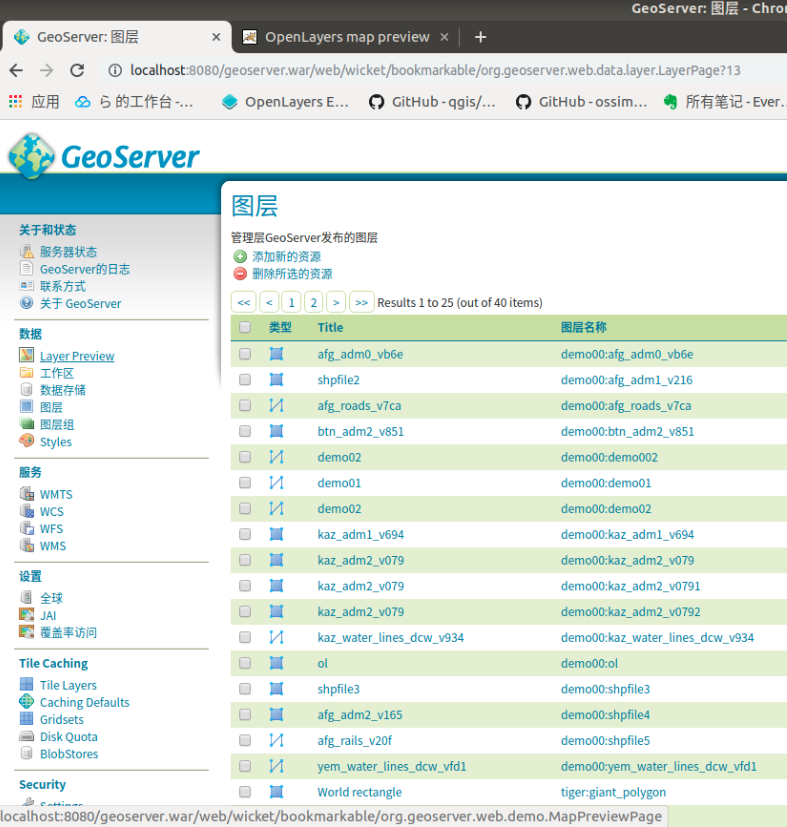

- After clicking, you can find the layer we want to publish and click `Openlayers`

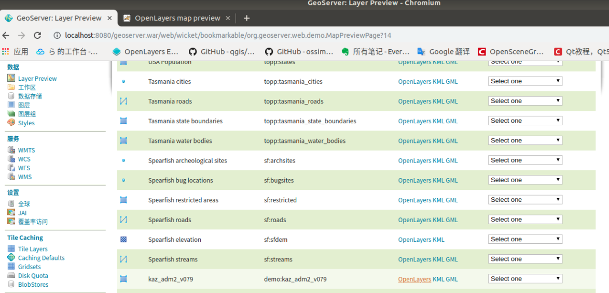

- As shown below

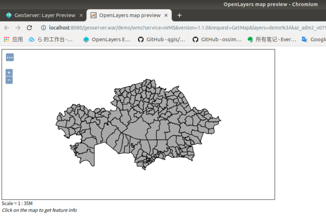

Full URL

    http://localhost:8080/geoserver.war/demo/wms?service=WMS&
    version=1.1.0&request=GetMap&layers=demo%3Akaz_adm2_v079&
    bbox=5175449.5%2C4946436.5%2C9719601.0%2C7446127.5&
    width=768&height=422&srs=EPSG%3A3857&format=application/openlayers

- WMS  selected services
- version  version information
- request  request method
- style  request a list of styles for the layer
- bbox  map extent (minx,miny,maxx,maxy)
- layers  layer name
- width  the width of the window
- height  the height of the window
- srs  spatial coordinate reference system (namespace:identifier)
- format  format