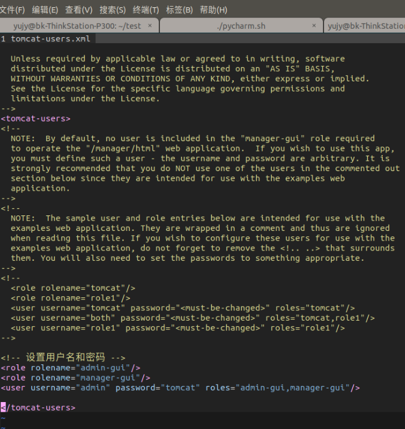
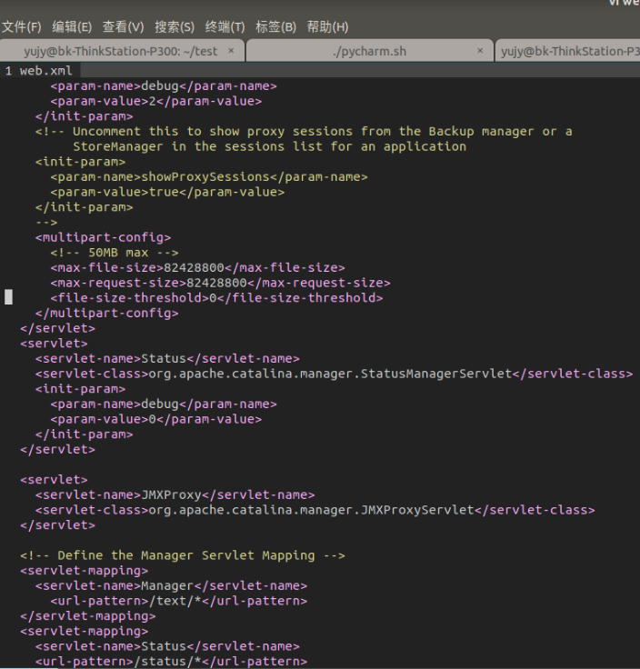
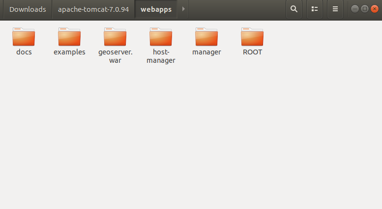
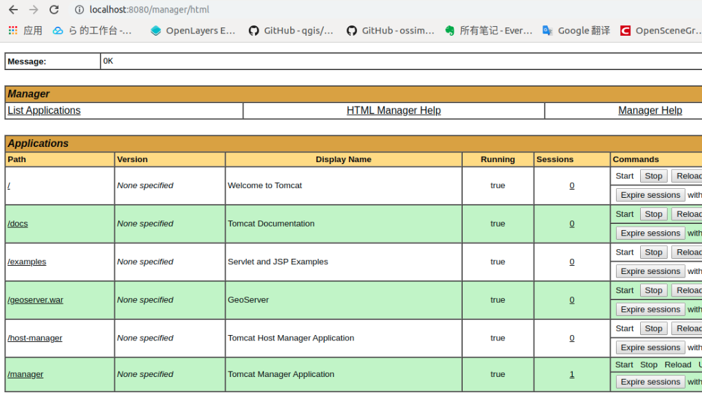

; Author: YU Jinyao
; Title: Installation configuration

# Install and configure GeoServer

GeoServer is an open source server for sharing geospatial data. GeoServer implements industry standard OGC protocols such as Web Feature Service (WFS), Web Map Service (WMS), and Web Coverage Service (WCS). Additional formats and publishing options are available as extensions, including Web Processing Service (WPS) and Web Map Tile Service (WMTS). Both can be published using GeoServer as a server. Before using the GeoServer server, you need to download and install another web server tomcat. Someone may have already installed it, but it needs to be configured.

## Configure tomcat

Tomcat server is a free and open source web application server, which is a lightweight application server. It is commonly used in small and medium-sized systems and occasions where there are not many concurrent access users. In fact, Tomcat is an extension of Apache server, but the runtime It runs standalone, so when you run tomcat, it actually runs as a separate process from Apache.

Configuration process:

- Install JDK
- Download and install tomcat
- Modify the configuration file

Download address of Tomcat:

    https://tomcat.apache.org/download-70.cgi


Currently the latest version of Tomcat is 9.0.27. Readers are free to download

Use console commands to operate after the download is complete

    cd dir/apache-tomcat-7.0.94/bin
    ./start.sh  

Open the browser address bar to enter

    localhost:8080

The following page indicates that the configuration is successful:


Let's go ahead and modify the configuration file:

First, set the user name and password, add security, and configure the file address.

    cd dir/apache-tomcat-7.0.94/conf
    vi tomcat-user.xml

There is a tomcat-user.xmlwen file opened in the file and added at the end of the file. Set the login account password to ```admin```, ```tomcat```




Next, modify web.xml, and change the file size from 50MB to 80MB, because the size of GeoServer will exceed 50MB, you can configure GeoServer after the configuration is complete.

    cd dir/apache-tomcat-7.0.94/webapps/manager/WEB-INF
    vi web.xml
    


Restart tomcat after completion, and the server needs to be restarted each time the configuration file is modified.


## Download and install GeoServer


Download address:

    http://geoserver.org/download/
    
Download the .war file and .bin file, here we mainly use the .war file as an example to decompress and copy the files to the webapps folder as shown in the figure.




Now you can enter the browser and use it. Open the browser to enter.

    localhost:8080

Click manager app



Click on geoserver.war


Username and password can be set at the same time


The installation and configuration of Geoserver has been completed, and the next article focuses on the use of Geoserver in conjunction with other applications.

    


