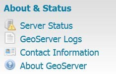
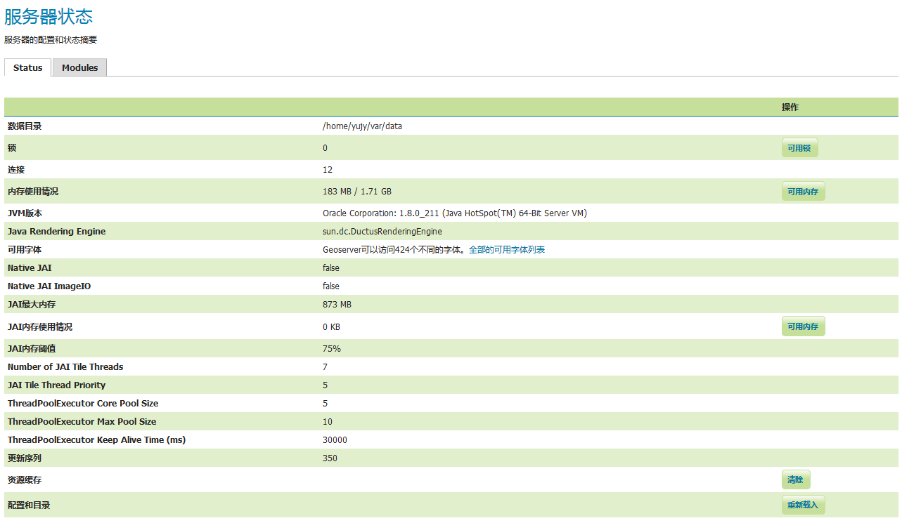
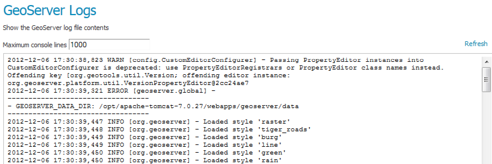
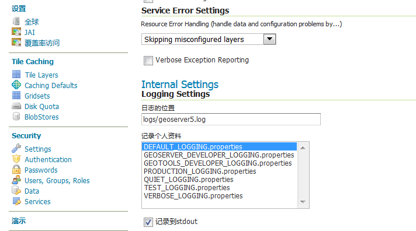
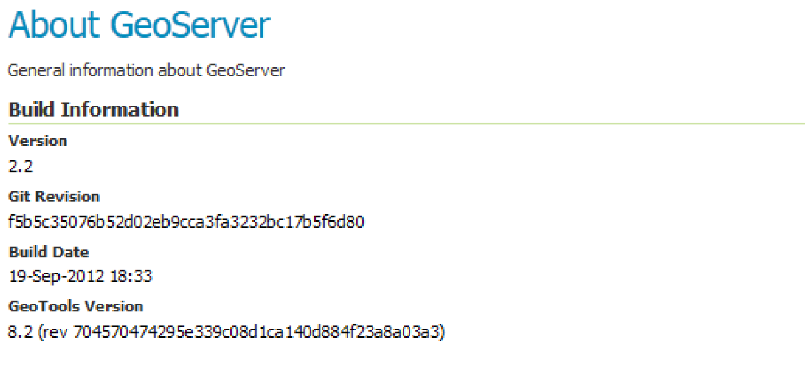

; Author: Bu Kun
; Title: Understand the interface of GeoServer

# Understand the interface of GeoServer

After logging in to GeoServer, now focus on the layout.

As you can see in the screenshot below, the GeoServer Web interface has three main areas.

The central area is where the information is displayed; the elements in it vary depending on what you do.
After logging in, it will show you brief information about the configuration data, 
as well as warnings or errors that should be corrected.
The version number is displayed at the end, and there is a link to the administrator's mailbox.

On the right, a list shows the capabilities of GeoServer.
The acronyms listed refer to the standard OGC protocol;
We will discuss some of these protocols in detail, each of which supports at least one version. These numbers are links to XML documents that describe exactly what data and operations are supported by each protocol. They are an invaluable resource for customers willing to use your services.

On the left, a directory lists the configuration areas. 
Each area contains links to administrative actions.
When you click one of the options, contextual options are displayed in the central area. 
We will explore each area in the next paragraph.

## About and status

This area provides information about run-time variables and how to describe GeoServer to clients connected to GeoServer.

## Server status

The server status gives you a good understanding of the main configuration parameters and information about the current state of GeoServer.
This information is organized in a tabular view.
In addition to providing information, this view allows you to perform some maintenance operations.
We will describe the main items listed in the following screenshot:

1.Lock

Using the transactional Web feature Service (WFS-T), the client can edit the configured feature type.
To avoid data corruption, GeoServer locks the data that needs to be traded until the transaction is completed.
If the number displayed is greater than 1, your data is doing some transactions. Free
Locks button allows you to reset a suspended editing session and delete all orphaned processes to release locks that may have been abandoned.

2.Connect

This displays the number of vector data storage connections.
Vector data repositories are repositories configured for feature persistence.

3.Memory usage

This shows how much memory GeoServer is using.
You can run the garbage collector manually by clicking the available memory button. This destroys Java objects marked for deletion.

4.JVM version and font

This is the version of the Java virtual machine (JVM) used by GeoServer.
You configured it in Chapter 2, getting started with GeoServer, during installation.
You will also see a list of fonts seen by JVM and GeoServer.
Fonts are useful for rendering space feature labels.
We will discuss this in Chapter 6, layer styling.

5.JAI usage and configuration

The Java Advanced Imaging (JAI) library is used for image rendering and for better performance when GeoServer processes raster data, as does Web CoverageService (WCS) and Web Map Service (WMS) requests. We will install native JAI support in Chapter 11, "Tuning GeoServer in Production".

6.Update sequence

This will show how many times the server configuration has been updated. At the time of this writing, the amount of information is not that large.
Developers seem to plan to use it to let you know that your configuration file has been updated from outside the application. It could be a rest call.

7.Resource caching

GeoServer also caches connections to storage, feature type definitions, external drawings, font definitions, and CRS definitions.
You can press the clear button to force these geoservers to reopen storage and re-read image and font information.

8.Configuration and directory

This option is useful for updating the configuration without having to restart the service. GeoServer keeps the configuration data in memory.
If an external process updates a file that contains configuration parameters, you can force GeoServer to reload data from disk.

## GeoServer log

From here you can preview the current log file or download the full content from the link at the bottom.
It can be useful when you cannot access the file system where the actual log files are stored.

The record of each execution is also saved in the log, and the configuration location of the saved location is in the global.

## Contact information

In this panel, information about the organization and people managing the service should be inserted.
The default configuration pays homage to the ancient cartographer Claudius Ptolemy (<http://en.wikipedia.org/wiki/Ptolemy>). This information is included in the WMS functionality and is a reference for users.

## About

As it says, this is just build information and where to find the entirety of the GeoServer documentation, bug tracker and wiki.

